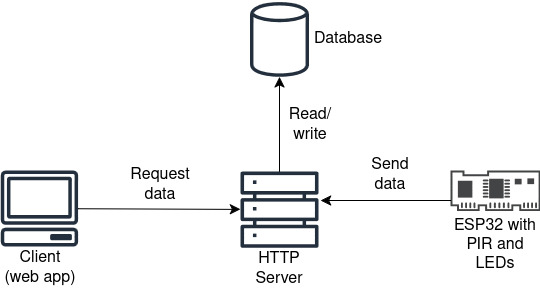

# IoT Specifikacija - SV7/2022
**Detekcija pokreta i praćenje preko interneta**

## Opis projekta
U ovom projektu koristi se ESP32 mikrokontroler, HC-SR501 PIR senzor pokreta i crvena LED dioda. PIR senzor pokreta biće povezan na ESP32 i služiće za detekciju pokreta. Kada senzor detektuje pokret, ESP32 će obraditi signal i aktivirati LED diode. LED-ovi će tada prikazivati unapred definisanu svetlosnu sekvencu, na primer efekat kružnog kretanja svetla. Na ovaj način se vizuelno signalizira da je pokret detektovan.

Pored lokalne signalizacije pomoću LED dioda, ESP32 će pri detekciji pokreta poslati HTTP zahtev ka udaljenom (hostovanom) serveru putem Wi-Fi konekcije. Ovaj zahtev će sadržati osnovne informacije o događaju, kao što su vreme detekcije i identifikacija uređaja. Server će primljene podatke obraditi i sačuvati u bazi podataka, čime se omogućava kasniji pregled, analiza i praćenje detektovanih pokreta putem web aplikacije.

Biće razvijena web aplikacija koja komunicira sa HTTP serverom putem API-ja. Aplikacija će omogućiti prikaz i praćenje detektovanih pokreta u realnom vremenu ili kroz istoriju događaja. Podaci sačuvani u bazi biće vizuelno predstavljeni korisniku (npr. lista događaja, vremenska linija ili grafički prikaz).

## Tehnologije
- ESP32: Programiran u C++ jeziku korišćenjem Arduino IDE okruženja. Povezivanje na internet biće ostvareno putem ugrađenog Wi-Fi modula, gde će se ESP32 povezivati na dostupnu bežičnu mrežu koristeći SSID i lozinku, nakon čega će moći da šalje HTTP zahteve ka serveru.  
- Web server: Implementiran kao HTTP server u Go jeziku, zadužen za prijem zahteva sa ESP32 uređaja, obradu podataka i njihovo prosleđivanje ka bazi podataka.  
- Baza podataka: Hostovana PostgreSQL ili neka time series baza.  
- Frontend aplikacija: Implementiran u Angular-u, sa fokusom na mobilni dizajn i layout.

## Bezbednost
Sistem će primeniti osnovne mere bezbednosti kako bi se zaštitili podaci i komunikacija između ESP32 uređaja, servera i veb aplikacije:
- ESP32 će prilikom slanja HTTP zahteva koristiti API ključ ili token, čime se sprečava neovlašćen pristup serveru.  
- Web aplikacija će zahtevati prijavu korisnika pre prikaza istorije događaja i praćenja pokreta.  
- HTTP zahtevi sa ESP32 mogu biti (potencijalno) realizovani preko HTTPS protokola kako bi se šifrovala komunikacija i sprečilo presretanje podataka.  
- Samo ovlašćeni korisnici i uređaji moći će da šalju podatke ili pristupaju web aplikaciji.  
- Dodatno, server može implementirati rate limiting kako bi se sprečile zloupotrebe ili preopterećenje sistema.

## Arhitektura sistema

